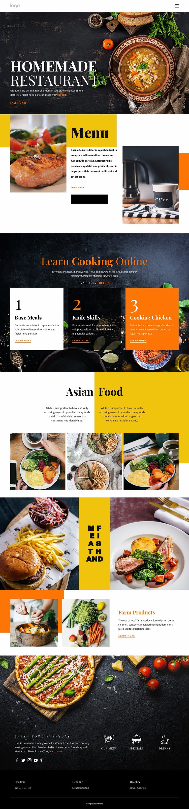

# Homemade Restaurant Demo Project

This project is a customizable restaurant template designed to help restaurants create an online presence for their business. The template includes various sections such as menu display, learn cooking online, and more.

## Features

- **Responsive Design:** The template is designed to work seamlessly across various devices, including desktops, tablets, and mobile phones.
- **Menu Display:** Showcase your restaurant's menu with customizable categories and items.
- **Image Gallery:** Showcase images of your restaurant, dishes, and ambiance to attract customers.
- **Social Media Integration:** Link to your restaurant's social media profiles for increased visibility and engagement.
- **Customizable:** Easily customize the template to match your restaurant's branding and style.

## Getting Started

Follow these steps to get started with the restaurant template:

1. **Clone the Repository:**

2. **Navigate to the Project Directory:**

cd restaurant-template

3. **Open `the project` in a Web Browser:**

- npm install

- npm run dev

## Usage

To customize the template for your restaurant:

1. **Modify Content:**
Update the content in `index.html` to reflect your restaurant's information, including menu items, contact details, and images.

2. **Customize Styles:**
Customize the styles in `styles.css` to match your restaurant's branding and aesthetic preferences.

3. **Add Images:**
Replace the placeholder images in the `img` folder with images of your restaurant, dishes, and ambiance.

4. **Test Responsiveness:**
Test the responsiveness of the template across different devices to ensure optimal user experience.

## Contact

If you have any questions, feedback, or suggestions, please feel free to reach out:

- Email: [dev.ahmadsipan@gmail.com](mailto:dev.ahmadsipan@gmail.com)
- Linkedin: [@ahmadsipan](https://www.linkedin.com/in/ahmadsipan/)
- GitHub: [YourUsername](https://github.com/sipanahmad)
